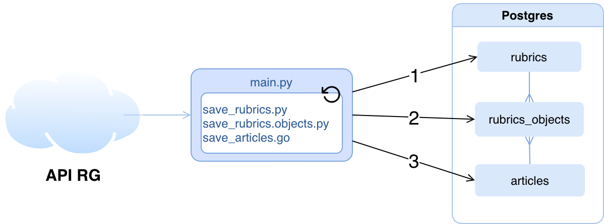

API-RG-DATA-MIGRATION
====================

Миграция данных из API RGRU в базу данных Postgresql. 

<a href="https://viewer.diagrams.net/?highlight=0000ff&p=anim&edit=_blank&layers=1&nav=1&title=RG%20NLP%20project.drawio#Uhttps%3A%2F%2Fdrive.google.com%2Fuc%3Fid%3D1yflDpag5TSUrKPRsHgFzR2sBhjBY_7tz%26export%3Ddownload">Общая схема всех приложений</a>
<br>
<br>


Программа выкачивает данные из API RGRU и сохраняет их базу данных Postgresql,
содержащую три таблицы:
```
 ribrics       ribrics_objects               articles
 (id)    --<   (rubric_id, object_id)  >---  (obj_id)

```
Названия полей таблиц соответствуют названиям полей данных API.


Требования к компьютеру разработчика
---------
1. golang 
2. python v>3.5. Выполните `pip install -r python/requirements.txt`.
3. Должна быть определена переменная окружения RGDSN 
   c параметрами подключения к Postgres.

**Выбор языка**

Python был выбран из за краткости кода и простоты работы с json. 
Golang используется из за простоты организации обработки 
множества одновременных запросов исполняемых в отдельных горутинах. 

Запуск программы
--------
1. Компиляция go кода.
    ```
    sh/build-executable.sh
    ```
2. Запуск 
    ```
    python python/main.py
    ```
    или в докере
    ```
    sh/up.sh
    ```


<!-- 
Первую версию sqllite можно скачать здесь: <https://1drv.ms/u/s!AmtnhvXAi-RmgoQuuTUD4gdrYrJPyA?e=L4175E> 
(Пароль: rosg******)
-->

Описание
-------
main.py организует вечный цикл с задержкой,в котором последовательно
вызываюся функции main() модулей save_rubrics, save_rubrics_objects и save_articles.
Каждый вызов создает и наполняет данными одну таблицу. 

Таблицы могут быть созданы и вызовами отдельных программ, что иногда удобно для отладки.

1. `python/save_rubrics.py` - сохранить рубрики в таблицу rubrics. (~ 1 тыс. записей)
2. `python/save_rubrics_objects.py` - сохранить  связи в таблицу rubrics_objects. ~3 млн записей.
3. `./save_articles` - сохранить статьи в таблицу articles. ~ 1,5 млн записей 

Если python не установлен, но есть docker, запуск можно осуществить следующими командами:

1. `docker run --rm  -v "$PWD:/app" -w "/app" python:3.7-alpine  sh -c "pip install -r python/requirements.txt && python python/1_save_rubrics.py"`
2. `docker run --rm  -v "$PWD:/app" -w "/app" python:3.7-alpine  sh -c "pip install -r python/requirements.txt && python python/1_save_rubrics_objects.py"`
3. `./save_articles` 

**Примечание**: Исполнямый файл `save_articles` создается командой `./build.sh`,
Если на компьютере установлен go. можно запустить программу и без компиляции командой `go run *.go`. 
Исполнение может занять несколько часов, размер файла базы данных составит около 9Гб.


## API RG

Доступ к API возможен только из внутренней сети rg.

Документация API.
- https://works.rg.ru/project/docs/?section=8

Получить JSON если известен URL материала нужно добавить DATAJSON
как префикс к пути. 

Kamil Ocean, [17.08.20 16:27]
- https://rg.ru/DATAJSON/2020/08/17/reg-pfo/putin-poobeshchal-podderzhat-proizvodstvo-novogo-aviadvigatelia.html

Максим Чагин, [17.08.20 17:13]

- https://rg.ru/xml/yandex/turbo.xml
- https://rg.ru/xml/yandex/turbo-2.xml
- https://rg.ru/xml/yandex/turbo-10.xml

Максим Чагин, [17.08.20 17:25]
- https://rg.ru/api/get/articles/reg-cfo/between-20130201-20130231/index.json

Максим Чагин, [17.08.20 17:25]
- https://rg.ru/api/get/object/by-uri/2013/02/28/reg-cfo/zastrojshik-anons.html.json

Максим Чагин, [17.08.20 17:27]
- https://rg.ru/rf/ - тут можно взять модификаторы для регионов

Максим Чагин, [17.08.20 17:29]
- Можно еще так https://rg.ru/include/tmpl-b-feed/is-announce/num-1000/index.json


Проксирование, для доступа из дома

https://outer.rg.ru/plain/proxy/?query=https://rg.ru/api/get/object/article-798781.xml

запрос к rg.ru поместить в query


Команды
-------
В директории `sh/` находятся следующие команды.


|   |   |
|---|---|
Подъем                                      | `sh/up.sh`
Полный останов контейнера                   | `sh/down.sh`
Подготовка директории deploy                | `sh/build-deploy-directory.sh`
Компиляция go                               | `sh/build-executable.sh`

Деплой
-------


на dockertest.rgwork.ru:/home/gitupdater/api-rg-data-migration-prod